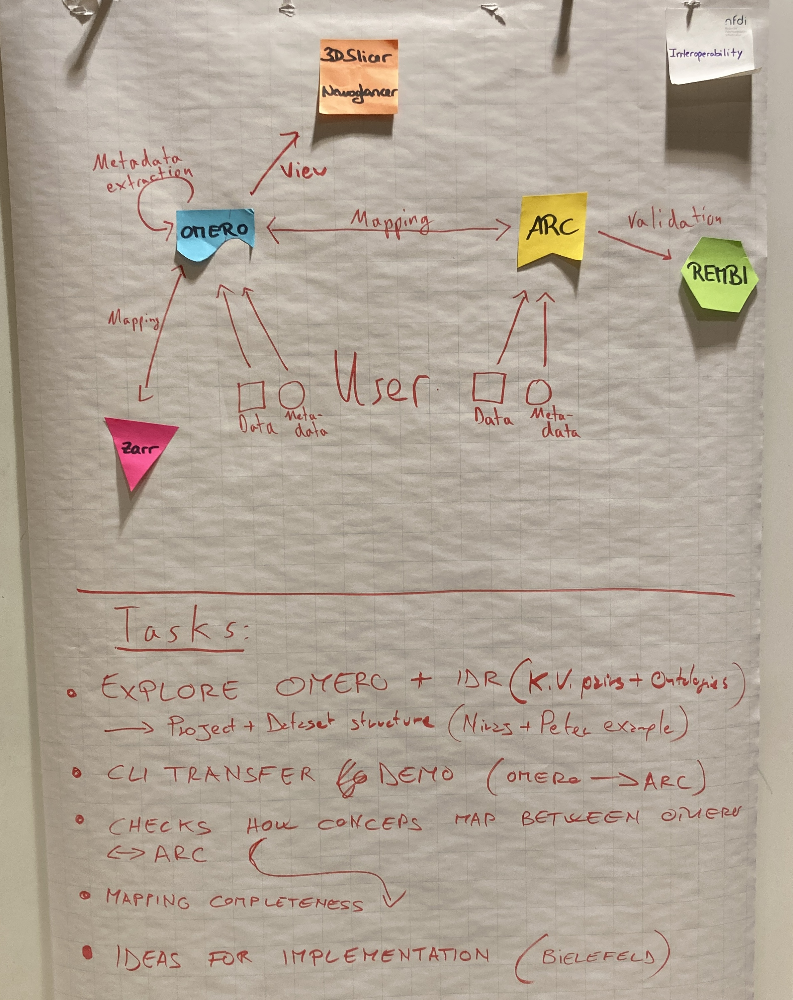
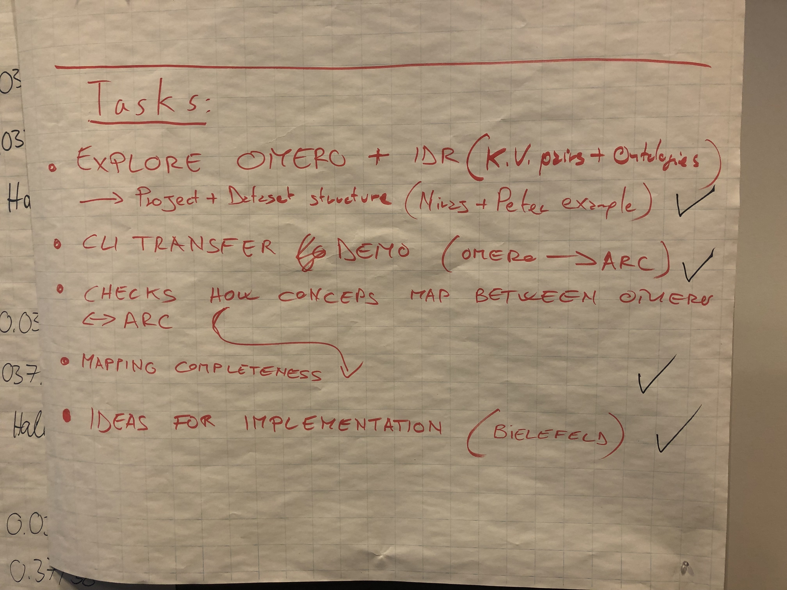

# Interoperability OMERO-ARC (ARC-BIDS, BIDS-OMERO)

## Brief non-specialist targeted introduction / summary
Most studies in the biological and medical sciences generate bioimaging datasets which can be organized, analyzed, and annotated effectively using OMERO as an RDM (Research Data Management) platform. However, current studies often produce multimodal datasets which include not only bioimaging data, but also measurements from other types of experiments. This requires the application of more generic RDM systems like ARC (Annotated Research Context). These systems, however, lack several functionalities that are needed for the effective management of bioimaging data, such as the ability to handle the huge variety of image formats and the many to many relationship between files and images. Additionally, a viewer with the ability to display ROIs (Regions Of Interest) and to modify, save and share channel intensities  is a crucial feature for the productive sharing and use of bioimaging data.

Thus a workflow leveraging the strengths of ARC for the management of different data types and OMERO for handling  complex microscopy images would provide research groups with a highly effective RDM tool. Therefore we decided to use this hackathon as the starting point for a discussion on how to setup a workflow including a bidirectional data and metadata transfer between OMERO and ARC. A tool for exporting images and metadata from OMERO to ARC had already been developed by Christoph Möhl and has recently been integrated into the omero-cli-transfer tool as a plugin (https://github.com/ome/omero-cli-transfer). This tool was taken as an example on which to base the discussion on OMERO-ARC interoperability and for the design specifications of a new tool for ARC to OMERO data and metadata transfer. 

The OMERO-ARC interoperability discussion touched on several topics including:
- **Mapping images to files** OMERO is based on images, while ARC is based on files. Depending on the format, an image can be constituted of multiple files or a single file can contain multiple images. Can the ARC model be modified to include a reference to the images in OMERO? Can the importing of the images to OMERO be used to generate this mapping?
- **Development of an ARC to OMERO transfer tool** The ARC to OMERO transfer tool will also be a plugin for omero-cli-transfer and will be developed at the deNBI hackathon in Bielefeld (https://github.com/NFDI4BIOIMAGE/BHG2023-OMERO-ARC). 
- **Mapping between ARC metadata and the ISA scheme to OMERO annotations** Discussion with DataPLANT members on how to efficiently map the Project/Dataset and Screen/Plate/Well structures in OMERO to the ARC schema.
- **Ownership of the imaging data**: Are the imaging data stored in OMERO, ARC, or both? Can symlinks be used to increase efficiency and avoid data duplication? How can me manage access and authentication?

The results of the discussions on these topics can be found following the links listed in the following section.

## Results, conceptual work and progress

### Results from the **workflow session**:  

Please note:  
"Bielefeld" links to the upcoming [OMERO-ARC de.NBI Hackathon project](https://www.denbi.de/de-nbi-events-archive/1614-towards-omero-and-arc-interoperability-for-rdm-compliant-bio-image-data) in Bielefeld.  
"IDR": Image Data Resource  
"K.V. pairs": key-value pairs, used in OMERO for metadata annotation.  

### [OMERO-ARC-Exporter-WorkFlow-Introduction.pdf](./OMERO-ARC-Exporter-WorkFlow-Introduction.pdf)
Slides summarizing the discussion on the design of an integrated worklow including the import/export of data from OMERO to ARC and viceversa.

### [omero_arc_exporter.md](./omero_arc_exporter.md)
Description of the current tool for exporting data and metadata from OMERO into an ARC dataset, and of its development into an omero-cli-transfer plugin. 

### [omero_arc_connection.md](./omero_arc_connection.md)
Summary of the discussion on three possible approaches for storing, accessing, transferring, and sharing imaging data between OMERO and ARC.

### [Omero-ARC-topic-'use-cases'.pdf](./Omero-ARC-topic-'use-cases'.pdf)
Illustration of the three possible approaches for storing, accessing, transferring, and sharing imaging data between OMERO and ARC.

### [omero_arc_mapping.md](./omero_arc_mapping.md)
Summary of the discussion on how to map images to files and containers (projects, datasets, screen, plates) to the ISA hyerarchy employed by ARC.

### Initiated an ARC-OMERO-IDR mapping table
Temporary link to the ARC-OMERO-IDR mapping table: https://docs.google.com/spreadsheets/d/1GWWFeN3_Q8ErTMR47StJmMOazkQKmnjwLsNSpqk70YQ/edit?usp=sharing

### **Progress** relative to the initial workflow session:  

### Helpful links

* [Generating test images](https://bio-formats.readthedocs.io/en/stable/developers/generating-test-images.html ) ([Bio-Formats](https://doi.org/10.1083/jcb.201004104))

## Final report

The final report at the last day of the hackathon for the Interoperability topic can be found [here](./Report/FinalReport_Interoperability.pdf).
