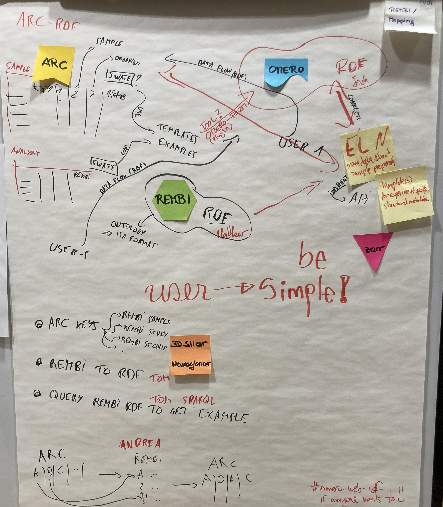

# REMBI - Mapping

**REMBI** is the abbreviation for **RE**commended **M**etadata for **B**iological **I**mages  

The REMBI publication can be read here: https://rdcu.be/dsDc6.  
At this Hackathon, we used a REMBI template from CAi (HHU Duesseldorf).  
The CAi REMBI template is adapted from the REMBI table in the supplementary information of the REMBI publication: https://doi.org/10.1038/s41592-021-01166-8.  

**TOC - In this README:**  
- [REMBI - Mapping](#rembi---mapping)
  - [Introduction for non-specialists](#introduction-for-non-specialists)
  - [Workflow session](#workflow-session)
  - [Results](#results)
    - [When following the suggested tasks file](#when-following-the-suggested-tasks-file)
    - [**Questions**](#questions)
    - [Progress](#progress)
  - [Report](#report)
  - [Outlook](#outlook)

## Introduction for non-specialists 
**+ Context of the "REMBI-Mapping" topic**

Metadata is data about data. Metadata can set biological images into context.  

*Possible diversity of metadata creating a respective annotated research context for biological images:*  

There are different types of metadata. For example data about persons like the person acquiring the image, analyzing the image, supervising or the person who has applied for the project. The biological image is part of an experiment conducted to answer a research question. Metadata beyond the image itself collects information about the project, experiment, method, sample preparation, species or specific genotype from which a sample was derived, the sample treatment and its preparation for image acquisition.  
Some metadata can be automatically extracted from the acquired image data. This can provide information about the image acquisition settings of the used device. Also, metadata about the file format can be extracted either being the raw data of the biological image or a derived file from image processing. Eventually, metadata about the image processing including scripts or file format conversions can be collected.  
Another important type of metadata informs the user (human or machine) about access rights, how the data can be used and what can be done with processed data derived e.g. from biological raw images.  

Obviously, the granularity and diversity of provided or required metadata might be very different.  

*How to determine what is required and required for what? Metadata in different contexts.*

First of all, there might be community or lab standards or rules to which the researcher wants or has to adhere.

Being a result within a research project, the [FAIR](https://doi.org/10.1038/sdata.2016.18) principles are a good guidance for this.
The data and its metadata should adhere to or enable for:  

- Findability
- Accessibility
- Interoperability
- Reusability

Research results should be reported, published and submitted to an appropriate repository. These often inform the researcher about the minimal requirements with respect to the data submitted and the expected metadata.
Several repositories for image data have stated to plan or already adhere to the guidance provided by the **RE**commended **M**etadata for **B**iological **I**mages.  

According to the REMBI publication, these are:  

- [BioImage Archive](https://www.ebi.ac.uk/bioimage-archive/)
- [EMPIAR](https://www.ebi.ac.uk/empiar/)
- [Cell-IDR](https://idr.openmicroscopy.org/cell/)
- [Tissue-IDR](https://idr.openmicroscopy.org/tissue/)

As imaging data is often only one type of data acquired in a research project and required to answer a respective research question, it needs to be set into a broader context and linked to the other types of specific data which also have their respective discipline- or method-specific standards or minimal requirements for submissions and proper data handling and acquisition.  
ARCs, the Annotate Research Context developed by DataPLANT intent to link all of these types of data with the respective metadata included into the ARC. When intending to transfer data into or from an ARC e.g. into OMERO, it is important to identify the imaging-specific metadata. The same holds true if imaging data is intended to be submitted to an imaging repository extracting metadata from the comprehensive metadata deposited inside the ARC. Also, it needs to be ensured, that the respective required metadata for such steps is present in an ARC and/or exported from OMERO into the ARC.

Therefore, a conceptual brainstorming about such mapping issues is indispensable to enable an efficient, successful and maintainable implementation of OMERO-ARC interoperability tools. Also, the extend of requested metadata based on the recommendations from REMBI and aligning to the repository's requirements needs to be accessed and examples need to be created both, to understand about the requirements for tool development and for supporting users eventually using such tools in the future.

Here, we are starting this process for the OMERO-ARC interoperability!

*Why using Ontologies?*  
Only on a second glance, users might grasp the importance of clear controlled vocabulary for this process. Often, there are terms which have a different meaning in different disciplines or even in different groups of people. If users start selecting their terminology used for the provided metadata from ontologies, this can balance tremendously for such unwanted effects and ensure that work invested by the user to describe the data is not lost and unambiguously usable for other users (humans or machines). Below, some suggestions for selecting appropriate terms from ontologies are provided. In ARCS the DataPLANT [Swate](https://github.com/nfdi4plants/Swate) tool can significantly support with this task by providing access to a broad set of ontologies from which users can select similar as e.g. [Ontobee](https://ontobee.org/) or the [annotator tool](https://bioportal.bioontology.org/annotator) as suggested below.

## Workflow session
First connections of REMBI with ARC and OMERO.

<!---The workflow session could be explained here and how the drawings at the boards evolved.\--->

<!---could be converted to a digital version, use ARC/ISA-specific terms (study, assay, source first, sample last)\--->

## Results

### When following the [suggested tasks file](../Cologne_Hackathon_Tasks.md)  

- Get OMERO running on the institutional instance.

- Which part of the dataset can we directly see inside OMERO, which not? Any ideas for support? 
  - No directory structure
  - xml files need to be added as attachment
    - This is because any non-bioformats compatible file needs to be added as an attachment.

- Try adhering to REMBI for the metadata.
  - Filling a REMBI template based on [CAi](https://www.cai.hhu.de/) experience (@VAFuchs, @Tom-TBT) for the [imaging ARC](https://git.nfdi4plants.org/natural-variation-and-evolution/microscopy_collection/map-by-seq_clsm-stacks) created by [CEPLAS](https://www.ceplas.eu) Data Science and Management (@andreaschrader).  
  - Respective plant-specific metadata including the meta data used in ARC and following the [ISA model](https://github.com/ISA-tools/isa-specs), has been selected before for the plant science ARC from ontologies using the DataPLANT [Swate](https://github.com/nfdi4plants/Swate) tool as well as the linked data server [Ontobee](https://ontobee.org/) as outlined [here](https://doi.org/10.3389/fpls.2023.1279694).  
  - The CAi team at HHU Düsseldorf and the respective CAi procedure furthermore suggests the following resources when selecting for REMBI metadata: [Selection rules for the right onotology](https://doi.org/10.1371/journal.pcbi.1004743), an [annotator tool](https://bioportal.bioontology.org/annotator) and the [EMBL-EBI Ontology Lookup Service](https://www.ebi.ac.uk/ols4/index).

- Which steps are necessary to achieve automatic import?
  - Outline strategies for mapping of microscopy related metadata (including REMBI aligned metadata) between ARC and OMERO.

### **Questions**  
  
- Should REMBI go into an ARC?
- Can we map ARC metadata to a REMBI template?
- Can we cherrypick the metadata of the ARC to extract the REMBI aligned metadata?
- Find out which metadata is required when submitting to an imaging repository that expect users to use REMBI?

### Progress

- Everyone got more acquainted with the concepts and tools
  - guidance for OMERO, learned about REMBI template used @CAi, navigated in an ARC, explored possibilities in Swate and discussed about the use of templates and appropriate ontology.  
  - Still some installations are required.

- Started documentation of the current state of the art and the steps done for this topic at the Cologne Hackathon.
- Collected possible issues for OMERO-ARC users:
  - How to import images/stacks in OMERO
  - Organization of data in OMERO (project/dataset compared to tags vs. key-value-pairs) for easier mapping to and from ARC.
- related to the omero-arc-exporter: How to handle "tags" in OMERO -> selection of metadata (subsets) for an ARC
- Possible combination of workflows and runs triggered from an ARC with OMERO and tools consuming input data from OMERO, retrieving output data and exporting this again into an ARC. Does this make sense?

Started bringing a dataset from the [example ARC](https://git.nfdi4plants.org/natural-variation-and-evolution/microscopy_collection/map-by-seq_clsm-stacks) into OMERO. 

## [Report](./Report/)

The final report at the last day of the hackathon for the REMBI-Mapping topic can be found [here](./Report/FinalReport_REMBI_Mapping.pdf).

## Outlook

- Using @Tom-TBT's ["Import KV from csv" ](https://github.com/German-BioImaging/omero-scripts/blob/xtnd_support_kvpairs/omero/annotation_scripts/) in OMERO to import the key-value pairs from csv files extracted from an ARC-style isa.investigation.xlsx with @pzentis's isaToKVP script [script](https://github.com/cecad-imaging/omero-arc-testdata/blob/main/scripts/isaToKVP.py)  
  
- Go the reverse way, i.e. do all above steps for export out of OMERO into structure
  - Use the [OMERO-ARC exporter](https://github.com/cmohl2013/omero-cli-transfer/tree/arc)

> Continue in particular with the **REMBI - ARC mapping initiative** towards RDM-compliant bioimaging metadata in ARCs as part of the [OMERO-ARC project](https://www.denbi.de/de-nbi-events-archive/1614-towards-omero-and-arc-interoperability-for-rdm-compliant-bio-image-data) at the upcoming de.NBI hackathon in Bielfeld.
> Work in this group was also preparatory work for this upcoming hackathon.  

> Moreover, focus on technical implementations enabling OMERO-ARC interoperability of RDM-compliant metadata.
